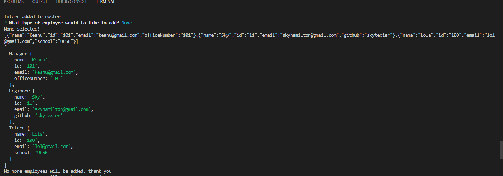

# Work Team Generator

## Description
This Work Team Generator uses Node.js, Inquirer and Jest to generate a webpage displaying a users work-team with their unique id's, roles, emails and so on. 
Through this application a user can select multiple different roles for their employees, enter their unique information and have that data displayed neatly on a webpage.
This application simplifies the process of creating a website for users by preparing a template HTML that adapts to Inquirer prompts, thus cutting out a lot of middle work a user might face trying to create  their  own webpage for their team's information.

The motivation behind building this application was to better understand how Javascript objects, classes and superconstructors work together. Similarly this application helped to foster a small example of how Jest tests can work.
The most challenging aspect of this application was figuring out how Inquirer can work with superconstructors and classes. Similarly figuring out how to call those classes' information within other scripts proved to be a challenge.
Overall this project reified my understanding of Inquirer and helped develop a deeper familiarity with object classes.

## Table of Contents
- [Installation] (#installation)
- [Usage/Examples](#usage-and-video-example)
- [Usage/Examples] (#usage)
- [Credits] (#credits)
- [License] (#license)

# Usage and Video Example
  
[This is a video link](https://drive.google.com/file/d/1LGSIBD1jT6PExy8Y95eLanOdcrAxXcEy/view?usp=sharing) to a basic walkthrough of how this application works. 

To run this application one must use `node index` in their terminal to begin the Work-Team-Generator proccess.

Here is a screenshot of what the terminal looked like in generating this HTML page.

And this is a screenshot of the finished HTML page

  
## Installation

The only requirement for this application to run is NodeJS and ensuring that both Inquirer and Node are up to date.
For tests one would need to install Jest if not already installed. 

## Usage/Examples

[This is a video link](https://drive.google.com/file/d/1lR3U2a_Tx7InEp64oWyv1Cja1pxxRUW-/view?usp=sharing) to a basic walkthrough of how this application works. Aside from this one must run `node index` in their terminal to begin the proccess.

Here is a screenshot of what the terminal looks like when generating this HTML page.

## Credits

## License
MIT License
 
Copyright (c) [2022] [Sky Hamilton Texier]
 
Permission is hereby granted, free of charge, to any person obtaining a copy
of this software and associated documentation files (the "Software"), to deal
in the Software without restriction, including without limitation the rights
to use, copy, modify, merge, publish, distribute, sublicense, and/or sell
copies of the Software, and to permit persons to whom the Software is
furnished to do so, subject to the following conditions:
 
The above copyright notice and this permission notice shall be included in all
copies or substantial portions of the Software.
 
THE SOFTWARE IS PROVIDED "AS IS", WITHOUT WARRANTY OF ANY KIND, EXPRESS OR
IMPLIED, INCLUDING BUT NOT LIMITED TO THE WARRANTIES OF MERCHANTABILITY,
FITNESS FOR A PARTICULAR PURPOSE AND NONINFRINGEMENT. IN NO EVENT SHALL THE
AUTHORS OR COPYRIGHT HOLDERS BE LIABLE FOR ANY CLAIM, DAMAGES OR OTHER
LIABILITY, WHETHER IN AN ACTION OF CONTRACT, TORT OR OTHERWISE, ARISING FROM,
OUT OF OR IN CONNECTION WITH THE SOFTWARE OR THE USE OR OTHER DEALINGS IN THE
SOFTWARE.

